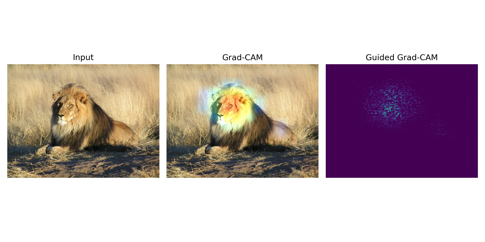

# Grad-CAM
by Tim Niklas Witte

An implementation of the [Grad-CAM](https://arxiv.org/abs/1610.02391) algorithm introduced by Ramprasaath R. Selvaraju et. al. in TensorFlow:
This method offers a visual explanation of the model's predictions, enriching our comprehension of its decision-making process by highlighting important parts in the images.
These important parts highly influence the model's predictions.



# Usage

## Visualize
Visualize Grad-CAM and Guided Grad-CAM on a single image. 
After displaying the resulting output plot (image), it will be stored at `./results/[same file name]`. 

```
usage: Visualize.py [-h] --path PATH

Visualize Grad-CAM

optional arguments:
  -h, --help   show this help message and exit
  --path PATH  Set the path to the image to which the Grad-CAM algorithm shall
               be applied.
```

Example

```
python3 Visualize.py --path ./imgs/Lion.jpg
```

## Webcam
By running the `Webcam.py` script you can visualize Grad-CAM and Guided Grad-CAM on your webcam video stream.

```
python3 Webcam.py
```

Note that, for this script there is no configuration via command line (aka runtime arguments) available.

## Create a video
Apply Grad-CAM and Guided Grad-CAM on a video file by running the `CreateVideo.py` script.

```
usage: CreateVideo.py [-h] --path PATH --out OUT

Visualize Grad-CAM in a video. Use q to quit.

optional arguments:
  -h, --help   show this help message and exit
  --path PATH  Set the path to the input video.
  --out OUT    Set name of the resulting output .MP4 file.
```

Example
```
python3 CreateVideo.py --path ../Garden.mp4 --out output
```
See result: [ Walking with Grad-CAM through my garden ](https://www.youtube.com/watch?v=OR2qOQuHknM)
 


# Requirements
- TensorFlow 2
- matplotlib
- cv2
- argparse
- Numpy
